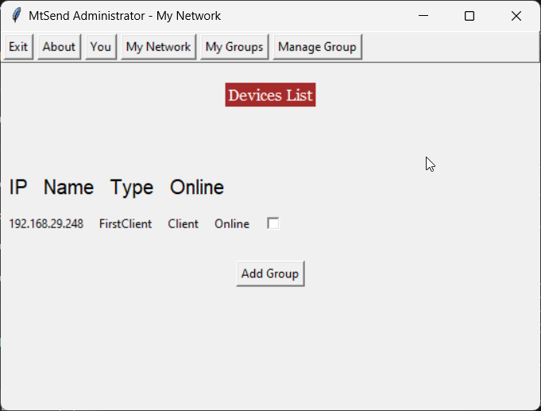
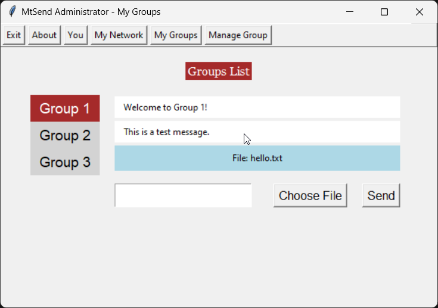
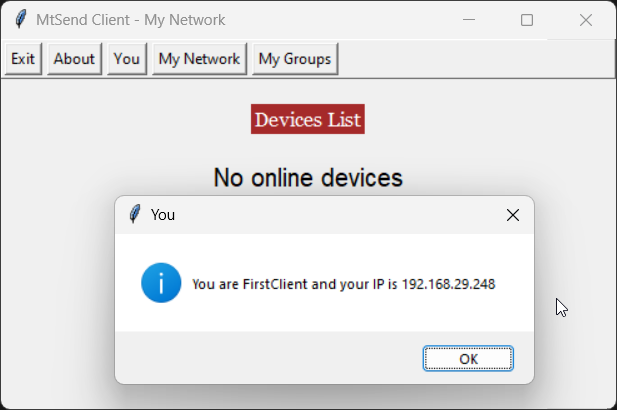

## mtsend - Multicast File Sharing System

## Snapshots




## Approach
0. We have tried reducing the number of packets sent by transferring files over Multicast (UDP) instead of sending to each client separately (TCP) and have handled the leftover chunks by re-requesting them as all the packets may not reach all the clients in UDP.
1. We use a main multicast socket on which all devices communicate including echoing its Online status.
2. The Admin Devices can create a group and add some users to it (3 groups are created as placeholders by default).
3. Only the requested clients by Admin can join the group, and over a temporary TCP connection group information is sent.
4. Now each group listens on its own Multicast address to which all the devices listen that belong to that group.
5. Text messages and Files are sent with a chunk size of 10KB in groups, chunks left will be re-requested by clients after the End of File packet received by Admin.

## Technology
Python + Tkinter (UI)

## Development
Recommended Python 3.8+

## Setup Instructions

1. Clone project
```bash
git clone https://github.com/YOUR-USERNAME-HERE/mtsend
cd mtsend
```

2. Create a virtual environment (recommended)
```
python -m venv venv
source venv/bin/activate  # On Windows use `venv\Scripts\activate`
```

3. Install required packages
```
pip install -r requirements.txt
```

4. Run the Project
```
python main.py
```
